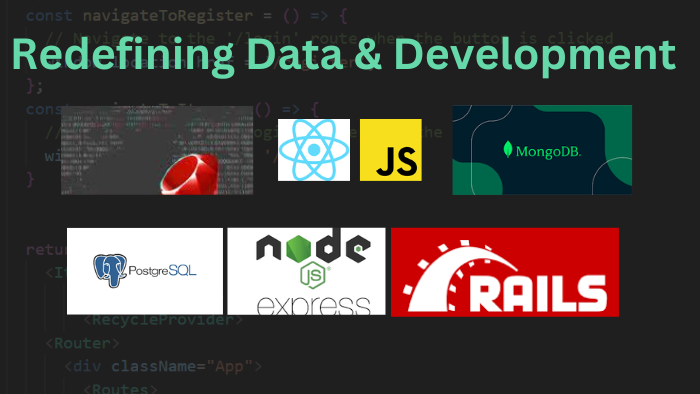

# Oluwasegun Idowu

## About Me

I am a Certified Scrum Master and Full Stack Developer based in Ontario, Canada, with extensive experience in project management and technology development. As the Founder and Project Manager of [CarePro](https://oncarepro.com/) and a founding team member of [YourBeat](https://yourbeat.ca/), I combine my technical expertise with strong leadership skills to deliver high-quality solutions. My passion lies in managing technology projects, implementing agile methodologies, and creating innovative applications that solve complex problems. I work closely with many startups as a backend expert and Scrum Master, helping teams achieve faster software delivery through optimized development lifecycles.

### Technical Skills
- JavaScript & TypeScript
- Express.js & Node.js
- MongoDB & PostgreSQL
- React.js
- Web3 Technologies & Smart Contracts
- Data Management Solutions
- Python

### Project Management Skills
- Certified Scrum Master
- Agile Methodology Implementation
- Cross-functional Team Leadership
- Technology Project Management
- Product Development Lifecycle
- Stakeholder Management

## Professional Experience

### YourBeat Inc - Founding Team Member
As a founding team member at [YourBeat](https://yourbeat.ca/), I contribute to building a Spotify-like application and community platform for entertainers and vendors that features:
- Custom blockchain integration with a proprietary coin for community transactions
- Backend systems that connect artists, venues, vendors, and fans
- Automated talent matchmaking and booking processes
- Secure digital rights management for artists

### CodeSquare - Managing Partner & Agile Project Manager
At [CodeSquare](https://www.codesquare.io/), I serve as a Managing Partner where I:
- Lead technical implementation of software projects
- Apply agile project management methodologies to deliver client solutions
- Oversee development teams and ensure project success
- Implement best practices in software development and delivery

### CarePro - Founder & Project Manager
I founded and currently manage [CarePro](https://oncarepro.com/), a healthcare technology platform designed to improve patient care management. In this role, I:
- Lead cross-functional development teams using agile methodologies
- Oversee the entire product development lifecycle
- Make key technical architecture decisions
- Manage stakeholder expectations and deliverables

### Blockchain & Web3 Projects
I have extensive experience working with blockchain technologies:
- Designing and implementing smart contracts
- Developing decentralized applications (dApps)
- Integrating Web3 technologies with traditional web applications
- Ensuring security and reliability in blockchain solutions

### Data Management Solutions
I've successfully managed various data-centric projects:
- Implementing robust data pipeline architectures
- Creating scalable data management systems
- Ensuring data security and compliance
- Developing data visualization solutions

## Current Projects

I'm currently working on several exciting initiatives, including:

1. **Healthcare Management Platform** - Expanding CarePro's capabilities with enhanced features and integrations.

2. **Blockchain-based Supply Chain Solution** - Implementing transparency and traceability using smart contracts.

3. **Data Analytics Platform** - Creating a comprehensive data analysis tool with machine learning capabilities.

## Collaboration Opportunities

I am always open to collaborating with other developers and enthusiasts on projects that align with my interests and expertise. If you have a project in mind or would like to discuss potential collaborations, feel free to reach out to me.

I'm particularly interested in opportunities related to:
- Project management and agile implementation
- Blockchain and Web3 technologies
- Healthcare technology solutions
- Data management and analytics systems

## Contact Information

You can contact me via:
- Email: [oluobamzy@gmail.com](mailto:oluobamzy@gmail.com)
- LinkedIn: [Idowu Oluwasegun Abiodun](https://www.linkedin.com/in/idowu-oluwasegun-abiodun/)
- Website: [CarePro](https://oncarepro.com/),[Codesquare](https://codesquare.io)

Let's work together to build amazing web applications and implement effective project management methodologies!

<!--
**oluobamzy/oluobamzy** is a ✨ _special_ ✨ repository because its `README.md` (this file) appears on your GitHub profile.

Here are some ideas to get you started:

- 🔭 I’m currently working on ...
- 🌱 I’m currently learning ...
- 👯 I’m looking to collaborate on ...
- 🤔 I’m looking for help with ...
- 💬 Ask me about ...
- 📫 How to reach me: ...
- 😄 Pronouns: ...
- ⚡ Fun fact: ...
-->
